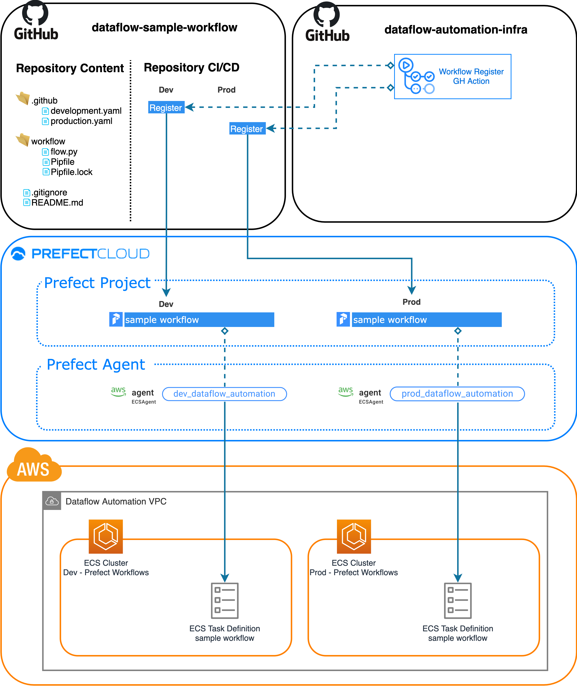

# dataflow-automation-infra 

## Table of Contents  
[Summary](#summary)  
[Architecture](#architecture)  
[Deployment](#deployment)  
<a name="summary"/>
 

## Summary

[Prefect](https://www.prefect.io/) is an open-source workflow management system that comes with many features that facilitates building, maintaining and troubleshooting data pipelines. Its [cloud solution](https://www.prefect.io/cloud/) puts a management layer on top of the framework that enables teams to schedule and troubleshoot workflows while operating under a [hybrid model](https://medium.com/the-prefect-blog/the-prefect-hybrid-model-1b70c7fd296) that guarantees that the execution layer remains on the customer side.

By saying that, the responsibility to *spin up* and *integrate* the execution layer with *Prefect Cloud* is on the customer's plate. This project works as a starting point for teams wanting to get up and running fast to experiment and deploy workflows with Prefect. Features:

### Automates the creation of execution environments on AWS
[Terraform](https://www.terraform.io/) is an open-source infrastructure as code tool used to spin up resources in the cloud. This project takes advantage of Terraform to spin up executions environments to run workflows.
 

### Integrates execution environments with Prefect Cloud
[Prefect Agent](https://docs.prefect.io/orchestration/agents/overview.html) is a long running process used to communicate *execution environments* with *Prefect Cloud*. This project builds a container image to run the Prefect Agent and creates the infrastructure around it that guarantees it is fault-tolerant and can successfully authenticate to Prefect Cloud.
 

### Offers an interface to register workflows
[Github Actions](https://github.com/features/actions) is a Github feature that automates the execution of workflows in response to events. It is used to define steps that build, test, and deploy projects on any platform while Github manages the pipeline execution. 
 
What makes Github Actions more interesting is that besides playing the common *CI/CD* role it also offers a marketplace of custom **actions** where developers can reuse existing logic to build their workflows and also publish their own **actions** for other developers/repositories to consume. 
 
This project maintains a *custom Github Action* responsible for deploying workflows to Prefect Cloud. Other repositories can then point to this action to easily push their workflows to Prefect Cloud and run them inside AWS execution environments deployed by *dataflow-automation-infra*. Please [check this repository](https://github.com/maikelpenz/dataflow-sample-workflow) to see this custom action in use.

&nbsp;<a name="architecture"/>
## Architecture

Four components are automatically deployed through the CI/CD pipeline of this repository. All steps are run across three different AWS environments (dev, test and prod)

* AWS Infrastructure: cloud resources required to execute workflows
* Prefect Agent Spin Up: this step builds the docker image where the Prefect Agent runs from and pushes it to AWS ECR
* Prefect Project Set Up: creates the prefect project on Prefect Cloud
* Prefect Workflow Register: Updates the Github Action responsible for registering workflows on Prefect Cloud

Besides deploying the components above, the CI/CD pipeline:

- Runs unit tests in *dev*
- Runs unit tests and functional tests in *test*
 

 

### Github Action - Workflow Register

This github action automates the registration of workflows with Prefect Cloud. Through its inputs/parameters one can configure memory/cpu and also pick an execution environment (deployed as part of this repo's infrastructure). 

The idea is that `dataflow-automation-infra` is only responsible for the infrastructure and workflows are placed in one or many external repositories. The following image illustrates how a workflow named `sample_workflow` is placed on a repository named `dataflow-sample-workflow` and uses the github action to register workflow versions for development and production environments. Once registered, the `prefect agent` listens to schedules/ad-hoc runs of this workflow and fire them to an AWS execution environment.

 

 

&nbsp;<a name="deployment"/>
## Deployment

Pre requisites:
* AWS Account
* Prefect Cloud Account
* Github Account

These are the steps to deploy the execution environment infrastructure to your own AWS account:
 

#### 1 - AWS: create access keys to be used by the Github CI/CD pipeline
The Github CI/CD pipeline must be able to communicate with your AWS Account to deploy resources. Here we create keys to grant the right access.

- Log into your AWS account
- Go to IAM > Users
- If you don't have a user created please click on `Add User`
- On the _Security credentials_ tab click on `Create access key`
- Copy both the _Access Key_ and the _Secret Access Key_ somewhere safe

#### 2 - Prefect Cloud: create _Agent_ and _Workflow Register_ API tokens 
Both the Github CI/CD pipeline and AWS must be able to connect to Prefect Cloud to spin up the agent and also to register workflows.

- Log into Prefect Cloud and under the top menu select `team` and then `Service Accounts`
- Click on `Add Service Account` and put a name to your group of API keys. E.g: ApisGroup
- use the `Create API Key` button to create 2 API keys: _PrefectAgent_ and _WorkflowRegister_. Make sure you copy the keys.

#### 3 - Github: Fork *dataflow-automation-infra*

- Fork and Clone this repository following the instructions [from this link](https://docs.github.com/en/github/getting-started-with-github/fork-a-repo)

#### 4 - Github: Configure *YOUR_GITHUB_ACCOUNT/dataflow-automation-infra* secrets
On your forked version of *dataflow-automation-infra* we will now configure secret variables so the CI/CD pipeline can connect to AWS and Prefect Cloud.
Credentials configured in this step uses the keys configured on steps 1 and 2 above.

- Using a web browser go to your forked repository on Github. On the top menu, click on `Settings`
- One the left side menu click on `Secrets`
- Create the following 4 secrets (names are self explanatory):

AWS_ACCESS_KEY_ID: <from step 1 above>
AWS_SECRET_ACCESS_KEY: <from step 1 above>
PREFECT_AGENT_TOKEN: <from step 2 above>
PREFECT_WORKFLOW_REGISTER_TOKEN: <from step 2 above>

#### 5 - Command line tool: Create branches to trigger the deployment pipeline
With the repository forked and credentials configured we can now create a branch and push it to _dev_, _test_ and _production_ environments.